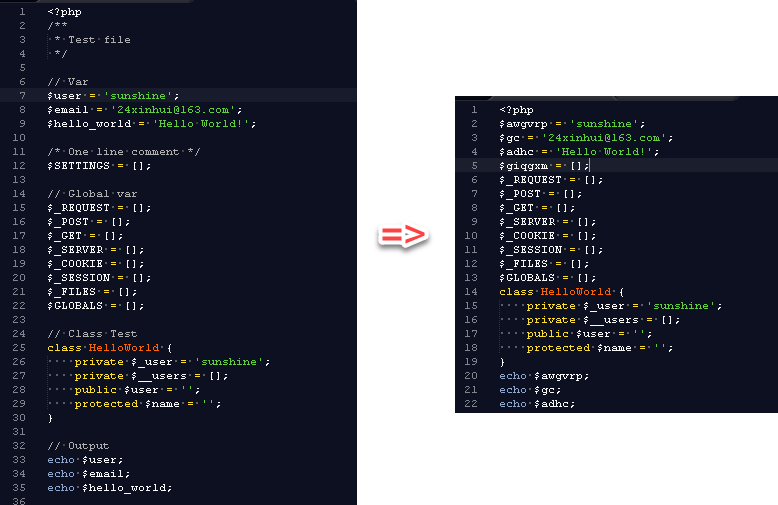

# ObscurePHP
Obscure PHP code, delete comments and blank lines.

（混淆PHP代码， 删除注释和空行）

## Function

（功能）
- 混淆变量
- 删除注释
- 删除空行

## Option

（选项）

Options|Default|Desc
---|:---|:---:
--no-obscure-var|混淆变量|不混淆代码
--keep-comment|删除注释|保留注释
--keep-blank-line|删除空行|保留空行
--path|项目test|待混淆路径
--save-path|混淆项目路径+obscure后缀|保存路径

## Usage

（用法）

命令行

- \> php obscure.php

使用默认配置，默认混淆变量/删除注释/删除空行

- \> php obscure.php --path=D:\ObscurePHP\src\test

指定需混淆路径

- \> php obscure.php --no-obscure-var

不混淆变量

- \> php obscure.php --keep-comment

保留注释

- \> php obscure.php --keep-blank-line

保留空行

## Author

Email: 24xinhui@163.com